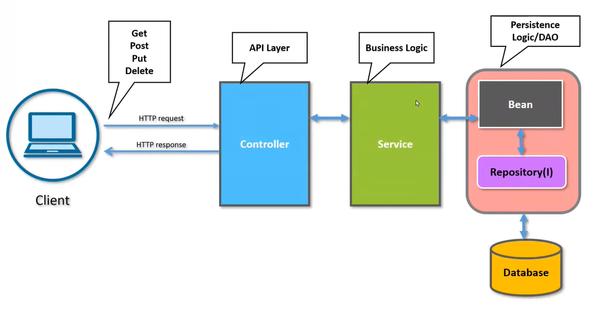

# Introduction to Spring Boot Web Service Restful and Unit Testing

### Technologies
1. Spring Boot 3
2. Java 17
3. Mockito to mock service and controllers (Unit testing)
4. MockMVC to mock controllers and endpoints (Unit testing)
5. TestRestTemplate to Integrate testing between Controllers and Database mock
6. H2 database (Database mock)

### Design Patter
